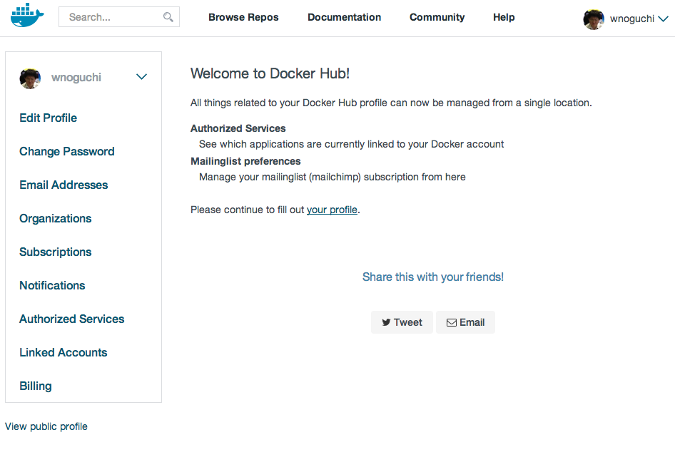
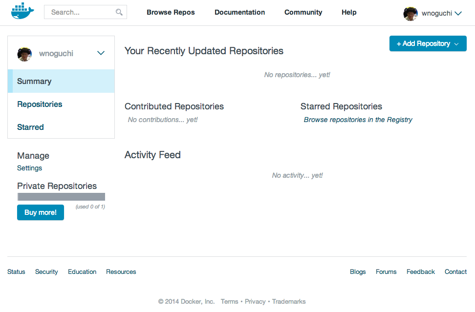

Docker
========

Dockerのメモ。

インストール
-------------

- CentOS6.5 x86_64

### EPEL有効にする

[EPEL - FedoraProject](https://fedoraproject.org/wiki/EPEL)

```
sudo rpm -ivh http://ftp.jaist.ac.jp/pub/Linux/Fedora/epel/6/i386/epel-release-6-8.noarch.rpm
```

### Dockerインストール

- Docker(1.0.0-6.el6)

- インストール

```
sudo yum install docker-io
```

- Dockerのサービススタート。

```
sudo service docker start
Starting cgconfig service:                                 [  OK  ]
Starting docker:	                                   [  OK  ]
```

- Dockerの自動起動設定。

```
sudo chkconfig docker on
```

- Dockerがちゃんと動いていることを確認するために最新版のCentOSイメージを取得する。

```
[vagrant@localhost ~]$ sudo docker pull centos:latest
Pulling repository centos
1a7dc42f78ba: Download complete
511136ea3c5a: Download complete
34e94e67e63a: Download complete
```

- 取得が完了したらCentOSのイメージの一覧が以下のコマンドでリストに表示されることを確認する。

```
[vagrant@localhost ~]$ sudo docker images centos
REPOSITORY          TAG                 IMAGE ID            CREATED             VIRTUAL SIZE
centos              latest              1a7dc42f78ba        7 days ago          236.4 MB
```

- イメージのテストをするためにbashを立ち上げてみよう。

```
sudo docker run -i -t centos /bin/bash
```

ちなみに `-i` はアタッチされていなくても標準入力を開いたままにしておくオプション。  
`-t` は擬似端末(pseudo-tty)を割り当てることを意味する。  
あいかわらずもやもやしている。

- [擬似端末 - Wikipedia](http://ja.wikipedia.org/wiki/%E6%93%AC%E4%BC%BC%E7%AB%AF%E6%9C%AB)

```
  -i, --interactive=false    Keep stdin open even if not attached
  -t, --tty=false            Allocate a pseudo-tty
```

で、結果が以下。

```
[vagrant@localhost ~]$ sudo docker run -i -t centos /bin/bash
bash-4.2#
```

うん、プロンプト表示された。

### 実験

このままじゃ面白く無いからMySQL（クライアント）入れてみる。

```
bash-4.2# yum -y install mysql
```

当然ながらホストには全く影響がない。

```
[vagrant@localhost ~]$ mysql
-bash: mysql: コマンドが見つかりません
[vagrant@localhost ~]$ sudo -i
[root@localhost ~]# mysql
-bash: mysql: コマンドが見つかりません
```

本当はMySQLサーバ入れてみたかったんだけど、コンテナの中で

```
yum -y install mysql-server
```

すると「そんなのねぇ！」って怒られる。

`mysql-server` がどのリポジトリに入っているのか調べると updates リポジトリに入っていることが分かる。

```
[root@localhost ~]# yum info mysql-server
Loaded plugins: fastestmirror
Loading mirror speeds from cached hostfile
 * base: centos.mirror.secureax.com
 * epel: ftp.jaist.ac.jp
 * extras: centos.mirror.secureax.com
 * updates: centosv4.centos.org
Available Packages
Name        : mysql-server
Arch        : x86_64
Version     : 5.1.73
Release     : 3.el6_5
Size        : 8.6 M
Repo        : updates
Summary     : The MySQL server and related files
URL         : http://www.mysql.com
License     : GPLv2 with exceptions
Description : MySQL is a multi-user, multi-threaded SQL database server. MySQL is a
            : client/server implementation consisting of a server daemon (mysqld)
            : and many different client programs and libraries. This package contains
            : the MySQL server and some accompanying files and directories.
```

ホスト側をupdatesでgrepするとヒットする。

```
[root@localhost ~]# cat /etc/yum.repos.d/CentOS-Base.repo | grep updates
# geographically close to the client.  You should use this for CentOS updates
#released updates
[updates]
mirrorlist=http://mirrorlist.centos.org/?release=$releasever&arch=$basearch&repo=updates
#baseurl=http://mirror.centos.org/centos/$releasever/updates/$basearch/
```

コンテナ内でgrepしてもヒットする。

```
bash-4.2# cat /etc/yum.repos.d/CentOS-Base.repo | grep updates
# geographically close to the client.  You should use this for CentOS updates
#released updates
[updates]
mirrorlist=http://mirrorlist.centos.org/?release=$releasever&arch=$basearch&repo=updates
#baseurl=http://mirror.centos.org/centos/$releasever/updates/$basearch/
```

うーん。なんで？

決定的違いを発見。

- ホスト

```
[root@localhost ~]# cat /etc/redhat-release
CentOS release 6.5 (Final)
```

- コンテナ

```
bash-4.2# cat /etc/redhat-release
CentOS Linux release 7.0.1406 (Core)
```

なんじゃこりゃ。

コンテナではmariadbとか出てたし、CentOS7になってなんか変わったのだろうか。  
追って色々調べよう。

とりあえず開発パッケージとか入れたりしてホストとコンテナの間で影響が無いことを確認して終了。

- `docker ps` コマンドを発行してみる。

`-a` オプションは終了したコンテナ環境も一覧表示してくれる。

```
[vagrant@localhost ~]$ sudo docker ps -a
CONTAINER ID        IMAGE               COMMAND             CREATED             STATUS                     PORTS               NAMES
59d7660a51a8        centos:latest       /bin/bash           33 minutes ago      Exited (0) 3 minutes ago                       clever_nobel
```

さっきのあるね。アタッチしてみよう。

```
[vagrant@localhost ~]$ sudo docker attach 59d7660a51a8
2014/07/16 14:30:54 You cannot attach to a stopped container, start it first
```

停止したコンテナはアタッチできないって言われた。では開始しよう。

```
[vagrant@localhost ~]$ sudo docker start 59d7660a51a8
59d7660a51a8
```

`docker ps` してみる。

```
[vagrant@localhost ~]$ sudo docker ps
CONTAINER ID        IMAGE               COMMAND             CREATED             STATUS              PORTS               NAMES
59d7660a51a8        centos:latest       /bin/bash           42 minutes ago      Up 25 seconds                           clever_nobel
```

おお動いてる。アタッチする。

```
[vagrant@localhost ~]$ sudo docker attach 59d7660a51a8
bash-4.2# which gcc
/usr/bin/gcc
bash-4.2#
```

ちゃんと環境復元できてる！そして `exit` したら

```
[vagrant@localhost ~]$ sudo docker ps
CONTAINER ID        IMAGE               COMMAND             CREATED             STATUS              PORTS               NAMES
```

でもコンテナは削除してないから

```
[vagrant@localhost ~]$ sudo docker ps -a
CONTAINER ID        IMAGE               COMMAND             CREATED             STATUS                     PORTS               NAMES
59d7660a51a8        centos:latest       /bin/bash           43 minutes ago      Exited (0) 4 seconds ago                       clever_nobel
```

残ってる。
やばいおもしろい。

Getting Started with Docker Hub
----------------------------------

[Getting Started with Docker Hub - Docker Documentation](https://docs.docker.com/userguide/dockerhub/)

Docker Hubに登録する。  
登録は簡単だった。





Dockerizing Applications: A "Hello world"
-------------------------------------------

[Dockerizing Applications - Docker Documentation](https://docs.docker.com/userguide/dockerizing/)

Dockerはコンテナ内でのアプリケーション実行を可能とする。

```
[vagrant@localhost ~]$ sudo docker run ubuntu:14.04 /bin/echo 'Hello world'
Unable to find image 'ubuntu:14.04' locally
Pulling repository ubuntu
e54ca5efa2e9: Download complete
511136ea3c5a: Download complete
d7ac5e4f1812: Download complete
2f4b4d6a4a06: Download complete
83ff768040a0: Download complete
6c37f792ddac: Download complete
Hello world
```

Dockerは `ubuntu:14.04` というイメージ名のものがローカルに存在することを確認し、
存在しなければ Docker Hub からダウンロードしてくる。

イメージの取得が終わればDockerは `/bin/echo 'Hello world'` を実行し、  
そのコマンドの実行が終了すればただちにコンテナを終了するようになっている。  
つまりHello worldと表示して終わり。

`-t` で擬似端末を割り当てて、 `-i` でDockerコンテナに対する標準入力を開いたままにする。つまりインタラクティブ。

```
[vagrant@localhost ~]$ sudo docker run -t -i ubuntu:14.04 /bin/bash
root@d857fbed59d2:/# pwd
/
root@d857fbed59d2:/# ls -F
bin/  boot/  dev/  etc/  home/	lib/  lib64/  media/  mnt/  opt/  proc/  root/	run/  sbin/  srv/  sys/  tmp/  usr/  var/
root@d857fbed59d2:/# exit
exit
```

今度はコンテナ内のbashのプロセスが終了するタイミングでコンテナが停止した。  
`docker ps` してみるとおもしろい。

```
[vagrant@localhost ~]$ sudo docker ps -a
CONTAINER ID        IMAGE               COMMAND                CREATED             STATUS                          PORTS               NAMES
d857fbed59d2        ubuntu:14.04        /bin/bash              2 minutes ago       Exited (0) About a minute ago                       sad_engelbart
b122a6b2cb7f        ubuntu:14.04        /bin/echo 'Hello wor   3 minutes ago       Exited (0) 3 minutes ago                            drunk_pasteur
59d7660a51a8        centos:latest       /bin/bash              24 hours ago        Exited (0) 23 hours ago                             clever_nobel
```

### デーモン化してみる

```
[vagrant@localhost ~]$ sudo docker run -d ubuntu:14.04 /bin/sh -c "while true; do echo hello world; sleep 1; done"
d9b0c80c495d41a11d8c552d39ceac65ed21b39a3d5adc695cf181d13dd9863c
```

1秒おきにhello worldを出力するジョブを半永久的に実行するコンテナで、これは `-d` オプションにてバックグラウンドで実行されるようになる。

hello worldは1つも標準出力に出てこない代わりにハッシュ値が得られた。  
これがコンテナIDというらしい。  
Gitのコミットハッシュみたいに先頭数桁使えばいけるのかな？

```
[vagrant@localhost ~]$ echo d9b0c80c495d41a11d8c552d39ceac65ed21b39a3d5adc695cf181d13dd9863c | wc -m
65
```

ちなみに65桁で構成されているようだ。

`docker ps` してみるとコンテナは終了せずに動き続けていることが分かる。

```
[vagrant@localhost ~]$ sudo docker ps
CONTAINER ID        IMAGE               COMMAND                CREATED             STATUS              PORTS               NAMES
d9b0c80c495d        ubuntu:14.04        /bin/sh -c 'while tr   2 minutes ago       Up 2 minutes                            hopeful_darwin
```

コンテナ名は便宜的に hopeful_darwin と付けられている。期待のMac OS X？英語のジョークはよくわからないな。

これじゃコンテナ内でどうなっているかわからないから `docker logs` コマンドを発行してみる。

```
[vagrant@localhost ~]$ sudo docker logs d9b0c80c495
hello world
hello world
hello world
hello world
hello world
hello world
hello world
hello world
hello world
[vagrant@localhost ~]$ sudo docker logs hopeful_darwin
hello world
hello world
hello world
hello world
hello world
hello world
hello world
hello world
```

コンテナID、コンテナ名でもどちらでもいけるようだ。

#### 片付けする

もう用済みなのでコンテナを停止する。

```
[vagrant@localhost ~]$ sudo docker stop hopeful_darwin
hopeful_darwin
```

停まったか確認する。

```
[vagrant@localhost ~]$ sudo docker ps
CONTAINER ID        IMAGE               COMMAND             CREATED             STATUS              PORTS               NAMES
```

すばらしい。今日はここまで。

References
------------

1. [CentOS 6.5 で Docker を使ってみる | CUBE SUGAR STORAGE](http://momijiame.tumblr.com/post/70679588212/centos-6-5-docker)
1. [いまさら聞けないDocker入門（1）：アプリ開発者もインフラ管理者も知っておきたいDockerの基礎知識 - ＠IT](http://www.atmarkit.co.jp/ait/articles/1405/16/news032.html)
1. [Docker Documentation](https://docs.docker.com/installation/#installation)
1. [CentOS - Docker Documentation](https://docs.docker.com/installation/centos/)
1. [Amazon EC2 - Docker Documentation](https://docs.docker.com/installation/amazon/)

### インストール後

1. [The Docker User Guide - Docker Documentation](https://docs.docker.com/userguide/)
