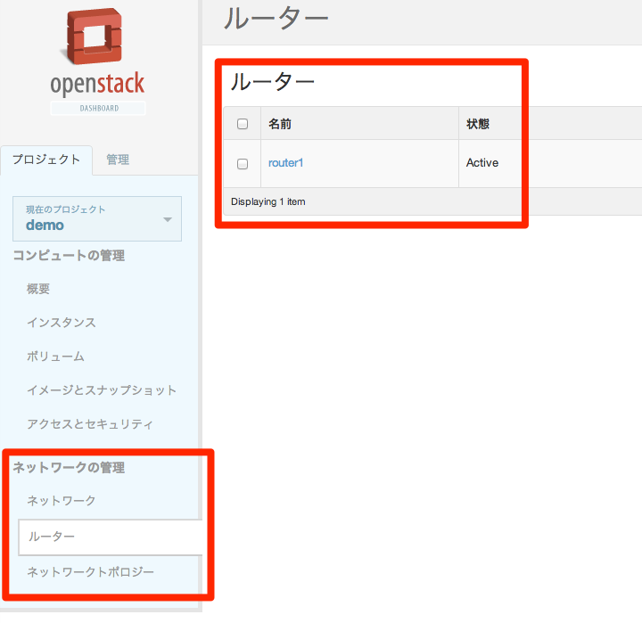
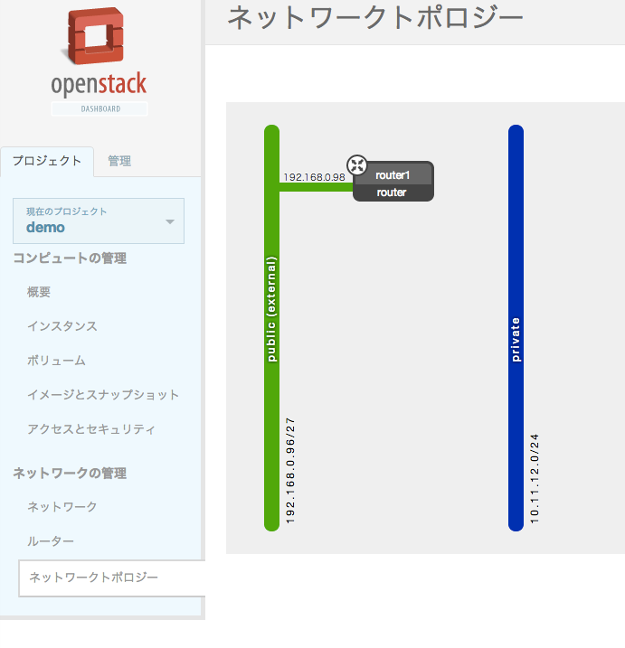
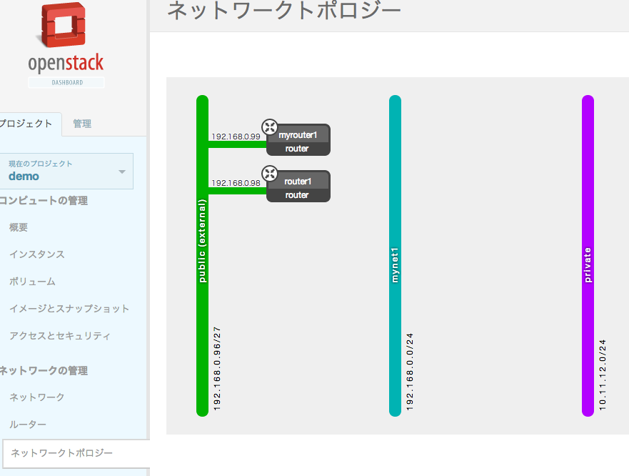

# UbuntuにAllInOne構成でOpenStackをインストール(Grizzly)

DevStackを使う。

## インストール

```
sudo apt-get -y update
sudo apt-get -y upgrade
sudo apt-get -y install git
```

### ユーザーstackを追加してパス無しsudoできるようにする

```
sudo adduser stack
sudo visudo
```

```
stack ALL=(ALL) NOPASSWD: ALL
```

```
logout
```

以降はユーザーstackでログインして作業。

```
git clone git://github.com/openstack-dev/devstack.git
cd devstack
git checkout stable/grizzly
```

```
cat <<EOF >localrc
FLOATING_RANGE=192.168.0.96/27
FIXED_RANGE=10.11.12.0/24
FIXED_NETWORK_SIZE=256
FLAT_INTERFACE=eth0
ADMIN_PASSWORD=supersecret
MYSQL_PASSWORD=iheartdatabases
RABBIT_PASSWORD=flopsymopsy
SERVICE_PASSWORD=iheartksl
EOF
```

パスワード入力を促されるがそのまま空エンターでOK。

```
./stack.sh
(snip)
[ERROR] ./stack.sh:638 nova-api did not start
```

なんやねん・・・。

[python - Error in devstack script. nova-api did not start? - Stack Overflow](http://stackoverflow.com/questions/17079919/error-in-devstack-script-nova-api-did-not-start)

もういっかい。

```
./unstack.sh
./stack.sh
```

回線細すぎてエラーになる。  
一回手動でnovaのリポジトリはとってこよう。

```
git clone https://github.com/openstack/nova.git /opt/stack/nova
error: RPC failed; result=18, HTTP code = 200 MiB | 32 KiB/s   
fatal: The remote end hung up unexpectedly
fatal: early EOF
fatal: index-pack failed
```

HTTPSだとだめみたい。
gitプロトコルに切り替える。

```
stack@wstack:~/devstack$ git clone git://github.com/openstack/nova.git /opt/stack/nova
Cloning into '/opt/stack/nova'...
remote: Counting objects: 199622, done.
remote: Compressing objects: 100% (50544/50544), done.
remote: Total 199622 (delta 159731), reused 182185 (delta 143338)
Receiving objects: 100% (199622/199622), 122.27 MiB | 96 KiB/s, done.
Resolving deltas: 100% (159731/159731), done.
```

```
./unstack.sh
./stack.sh


Horizon is now available at http://192.168.0.10/
Keystone is serving at http://192.168.0.10:5000/v2.0/
Examples on using novaclient command line is in exercise.sh
The default users are: admin and demo
The password: supersecret
This is your host ip: 192.168.0.10
stack.sh completed in 245 seconds.
```

とりあえずうまくいった。
cirros立ち上げてセキュリティグループも編集したけどping飛ばない。  
ログ見てみた。

```
checking http://169.254.169.254/2009-04-04/instance-id
failed 1/20: up 1.06. request failed
failed 2/20: up 6.07. request failed
failed 3/20: up 9.07. request failed
failed 4/20: up 14.07. request failed
failed 5/20: up 17.07. request failed
failed 6/20: up 22.08. request failed
failed 7/20: up 25.08. request failed
failed 8/20: up 30.09. request failed
failed 9/20: up 33.09. request failed
failed 10/20: up 38.10. request failed
failed 11/20: up 41.10. request failed
failed 12/20: up 46.11. request failed
```

たぶんNICまわりだろうなあ・・・。

```
disable_service n-net
enable_service q-svc
enable_service q-agt
enable_service q-dhcp
enable_service q-l3
enable_service q-meta
enable_service neutron
# Optional, to enable tempest configuration as part of devstack
enable_service tempest
```

かなり何度もunstack and stackを繰り返すことになりそうなのでaliasを定義する。

```
./unstack.sh && ./stack.sh
alias restack='./unstack.sh && ./stack.sh'
```

DevStackはタイミングの問題でエラーになることが多々あるから何回か打ちなおしてみるのもいいんじゃないですかね。

**うお、Quantum追加したらなんかメニュー増えた。**





これはやばいですね・・・。

### Neutron系が意味不明

**わからなくなったら `neutron help` 。**

[quantum · irixjp/openstack-study-9 Wiki](https://github.com/irixjp/openstack-study-9/wiki/quantum)

とりあえずNeutronのHorizonインタフェースは豪華だけど微妙に不完全らしいからコマンド体系を自分で
補完しないといけないっぽい。

```
stack@wstack:~/devstack$ quantum net-list
+--------------------------------------+---------+----------------------------------------------------+
| id                                   | name    | subnets                                            |
+--------------------------------------+---------+----------------------------------------------------+
| 7e842f83-2713-4bba-8e98-2d62b9221667 | public  | 1dd975a1-9c80-4fcc-9478-2d2a4415cd08               |
| a18fea4e-a6e7-43b6-a24c-73858a7b7464 | private | c30bd4f0-a232-459b-98b5-d78fbc08941a 10.11.12.0/24 |
+--------------------------------------+---------+----------------------------------------------------+

stack@wstack:~/devstack$ quantum net-create mynet1
Created a new network:
+-----------------+--------------------------------------+
| Field           | Value                                |
+-----------------+--------------------------------------+
| admin_state_up  | True                                 |
| id              | 45efb95b-448d-4e85-a72c-5956b4ca8435 |
| name            | mynet1                               |
| router:external | False                                |
| shared          | False                                |
| status          | ACTIVE                               |
| subnets         |                                      |
| tenant_id       | 135c9a897878463f988c3ac68516b759     |
+-----------------+--------------------------------------+

stack@wstack:~/devstack$ quantum net-list
+--------------------------------------+---------+----------------------------------------------------+
| id                                   | name    | subnets                                            |
+--------------------------------------+---------+----------------------------------------------------+
| 45efb95b-448d-4e85-a72c-5956b4ca8435 | mynet1  |                                                    |
| 7e842f83-2713-4bba-8e98-2d62b9221667 | public  | 1dd975a1-9c80-4fcc-9478-2d2a4415cd08               |
| a18fea4e-a6e7-43b6-a24c-73858a7b7464 | private | c30bd4f0-a232-459b-98b5-d78fbc08941a 10.11.12.0/24 |
+--------------------------------------+---------+----------------------------------------------------+

stack@wstack:~/devstack$ quantum subnet-create --ip-version 4 --gateway 172.26.0.254 45efb95b-448d-4e85-a72c-5956b4ca8435 172.26.0.0/24
Created a new subnet:
+------------------+------------------------------------------------+
| Field            | Value                                          |
+------------------+------------------------------------------------+
| allocation_pools | {"start": "172.26.0.1", "end": "172.26.0.253"} |
| cidr             | 172.26.0.0/24                                  |
| dns_nameservers  |                                                |
| enable_dhcp      | True                                           |
| gateway_ip       | 172.26.0.254                                   |
| host_routes      |                                                |
| id               | 5fe01e0e-de3b-4fac-ac13-c6d0bc56684a           |
| ip_version       | 4                                              |
| name             |                                                |
| network_id       | 45efb95b-448d-4e85-a72c-5956b4ca8435           |
| tenant_id        | 135c9a897878463f988c3ac68516b759               |
+------------------+------------------------------------------------+

stack@wstack:~/devstack$ quantum router-create myrouter1
Created a new router:
+-----------------------+--------------------------------------+
| Field                 | Value                                |
+-----------------------+--------------------------------------+
| admin_state_up        | True                                 |
| external_gateway_info |                                      |
| id                    | 43274dec-30a7-485c-ba9b-4e27175970f2 |
| name                  | myrouter1                            |
| status                | ACTIVE                               |
| tenant_id             | 135c9a897878463f988c3ac68516b759     |
+-----------------------+--------------------------------------+


stack@wstack:~/devstack$ sudo ip netns exec qrouter-43274dec-30a7-485c-ba9b-4e27175970f2 route -n
Cannot open network namespace: No such file or directory
stack@wstack:~/devstack$ ip netns list
qrouter-cc84daca-df5b-4521-a477-01919ff396ef
qdhcp-a18fea4e-a6e7-43b6-a24c-73858a7b7464
qrouter-7be8690e-8a61-48c2-926f-f87a90a55ee7
qdhcp-b3ffd65b-dc25-4d9d-a729-1342122cfcf4


```

[Question #206604 : Questions : neutron](https://answers.launchpad.net/neutron/+question/206604)

```
stack@wstack:~/devstack$ quantum router-list
+--------------------------------------+-----------+--------------------------------------------------------+
| id                                   | name      | external_gateway_info                                  |
+--------------------------------------+-----------+--------------------------------------------------------+
| 43274dec-30a7-485c-ba9b-4e27175970f2 | myrouter1 | null                                                   |
| cc84daca-df5b-4521-a477-01919ff396ef | router1   | {"network_id": "7e842f83-2713-4bba-8e98-2d62b9221667"} |
+--------------------------------------+-----------+--------------------------------------------------------+
```


増殖する仕様

```


stack@wstack:~/devstack$ ip netns list
qrouter-7f95083d-2e80-413b-bd1b-5ece1a16f193
qdhcp-da940418-988a-484a-a32a-eabad1a62cc4

stack@wstack:~/devstack$ neutron router-list
+--------------------------------------+---------+--------------------------------------------------------+
| id                                   | name    | external_gateway_info                                  |
+--------------------------------------+---------+--------------------------------------------------------+
| 7f95083d-2e80-413b-bd1b-5ece1a16f193 | router1 | {"network_id": "c23a6e36-977e-4936-932b-75d2dad0bfcf"} |
+--------------------------------------+---------+--------------------------------------------------------+


stack@wstack:~/devstack$ neutron net-list
+--------------------------------------+---------+----------------------------------------------------+
| id                                   | name    | subnets                                            |
+--------------------------------------+---------+----------------------------------------------------+
| c23a6e36-977e-4936-932b-75d2dad0bfcf | public  | b86dc4ed-89a7-4b1b-8e55-cd97dc98434e               |
| da940418-988a-484a-a32a-eabad1a62cc4 | private | dd641ea4-4a94-497c-b392-c1cc28d831ec 10.11.12.0/24 |
+--------------------------------------+---------+----------------------------------------------------+

```

Neutron系のコマンド体系を諦めてQuantum系へシフト。

```
quantum subnet-create --ip-version 4 --gateway 192.168.0.1 04a49673-b5b6-4b1b-bde9-99ad97045a0a 192.168.0.0/24

stack@wstack:~/devstack$ quantum net-create mynet1
Created a new network:
+-----------------+--------------------------------------+
| Field           | Value                                |
+-----------------+--------------------------------------+
| admin_state_up  | True                                 |
| id              | 04a49673-b5b6-4b1b-bde9-99ad97045a0a |
| name            | mynet1                               |
| router:external | False                                |
| shared          | False                                |
| status          | ACTIVE                               |
| subnets         |                                      |
| tenant_id       | 69f39d019d6e4b15a0f48dea264646ef     |
+-----------------+--------------------------------------+


stack@wstack:~/devstack$ quantum subnet-create --ip-version 4 --gateway 192.168.0.1 04a49673-b5b6-4b1b-bde9-99ad97045a0a 192.168.0.0/24
Created a new subnet:
+------------------+--------------------------------------------------+
| Field            | Value                                            |
+------------------+--------------------------------------------------+
| allocation_pools | {"start": "192.168.0.2", "end": "192.168.0.254"} |
| cidr             | 192.168.0.0/24                                   |
| dns_nameservers  |                                                  |
| enable_dhcp      | True                                             |
| gateway_ip       | 192.168.0.1                                      |
| host_routes      |                                                  |
| id               | 20730efe-0e7f-414d-bd9f-1f06342128a8             |
| ip_version       | 4                                                |
| name             |                                                  |
| network_id       | 04a49673-b5b6-4b1b-bde9-99ad97045a0a             |
| tenant_id        | 69f39d019d6e4b15a0f48dea264646ef                 |
+------------------+--------------------------------------------------+


stack@wstack:~/devstack$ quantum router-create myrouter1
Created a new router:
+-----------------------+--------------------------------------+
| Field                 | Value                                |
+-----------------------+--------------------------------------+
| admin_state_up        | True                                 |
| external_gateway_info |                                      |
| id                    | 72a879bd-3f70-4e91-becb-a17b1191a83d |
| name                  | myrouter1                            |
| status                | ACTIVE                               |
| tenant_id             | 69f39d019d6e4b15a0f48dea264646ef     |
+-----------------------+--------------------------------------+

ルーターがっちゃんこ

stack@wstack:~/devstack$ quantum router-gateway-set 72a879bd-3f70-4e91-becb-a17b1191a83d c23a6e36-977e-4936-932b-75d2dad0bfcf
Set gateway for router 72a879bd-3f70-4e91-becb-a17b1191a83d
```

現在の状態



```
stack@wstack:~/devstack$ ping 192.168.0.98
PING 192.168.0.98 (192.168.0.98) 56(84) bytes of data.
64 bytes from 192.168.0.98: icmp_req=1 ttl=64 time=0.299 ms
64 bytes from 192.168.0.98: icmp_req=2 ttl=64 time=0.049 ms
64 bytes from 192.168.0.98: icmp_req=3 ttl=64 time=0.055 ms
^C
--- 192.168.0.98 ping statistics ---
3 packets transmitted, 3 received, 0% packet loss, time 1998ms
rtt min/avg/max/mdev = 0.049/0.134/0.299/0.116 ms
stack@wstack:~/devstack$ ping 192.168.0.99
PING 192.168.0.99 (192.168.0.99) 56(84) bytes of data.
64 bytes from 192.168.0.99: icmp_req=1 ttl=64 time=0.327 ms
64 bytes from 192.168.0.99: icmp_req=2 ttl=64 time=0.045 ms
64 bytes from 192.168.0.99: icmp_req=3 ttl=64 time=0.054 ms
^C
--- 192.168.0.99 ping statistics ---
3 packets transmitted, 3 received, 0% packet loss, time 1999ms
rtt min/avg/max/mdev = 0.045/0.142/0.327/0.130 ms
stack@wstack:~/devstack$ ping 192.168.0.100
PING 192.168.0.100 (192.168.0.100) 56(84) bytes of data.
^C
--- 192.168.0.100 ping statistics ---
2 packets transmitted, 0 received, 100% packet loss, time 999ms

```

pingとぶ


## 参考リンク

- [Single Machine Guide - DevStack](http://devstack.org/guides/single-machine.html)
- [openstack-dev/devstack](https://github.com/openstack-dev/devstack/tree/stable/grizzly)
- [「オープンソース」を使ってみよう (第23回 DevStackでラクラク導入！ OpenStackを使ってみよう編)](http://www.ospn.jp/press/20120828no27-useit-oss.html)

### Neutron系

[quantum · irixjp/openstack-study-9 Wiki](https://github.com/irixjp/openstack-study-9/wiki/quantum)
[Running Virtual Machine Instances - OpenStack Installation Guide for Red Hat Enterprise Linux, CentOS, and Fedora  - master](http://docs.openstack.org/trunk/openstack-compute/install/yum/content/running-an-instance.html)
