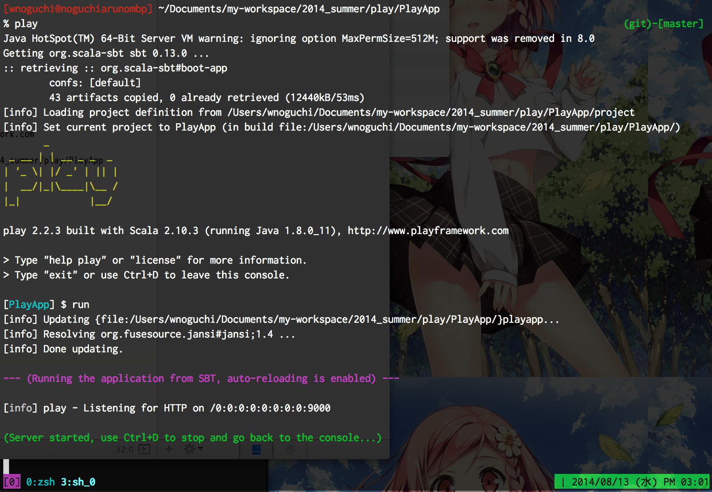
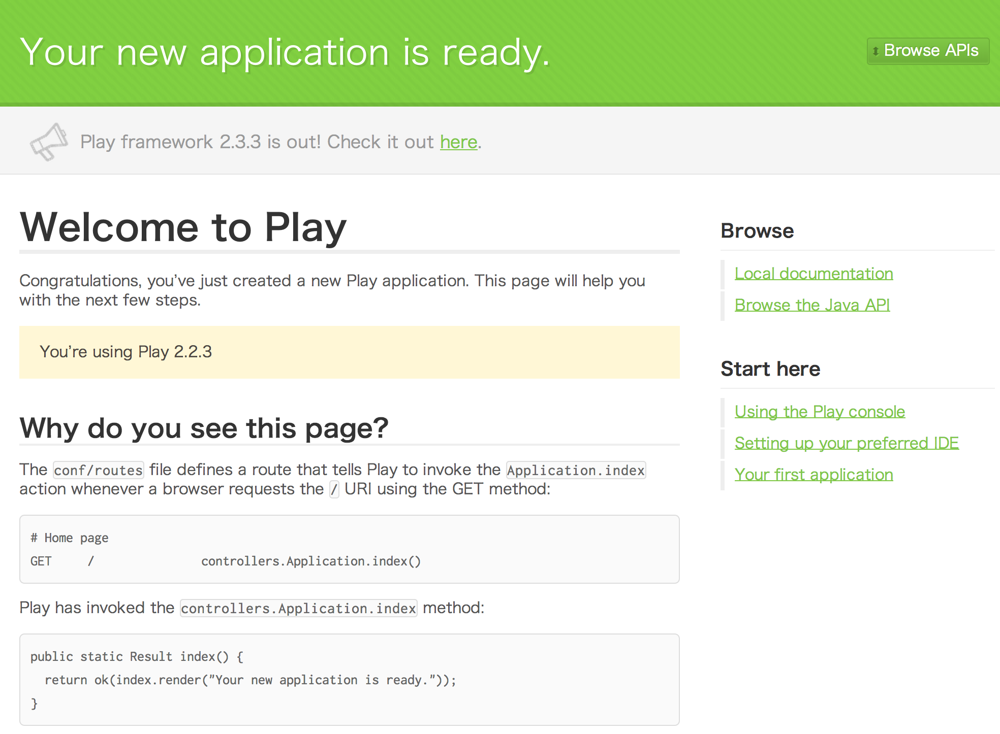

Play Framework 2
==================

Getting Started
-----------------

### New

```
% play new PlayApp
       _
 _ __ | | __ _ _  _
| '_ \| |/ _' | || |
|  __/|_|\____|\__ /
|_|            |__/

play 2.2.3 built with Scala 2.10.3 (running Java 1.8.0_11), http://www.playframework.com

The new application will be created in /Users/wnoguchi/Documents/my-workspace/2014_summer/play/PlayApp

What is the application name? [PlayApp]
>

Which template do you want to use for this new application?

  1             - Create a simple Scala application
  2             - Create a simple Java application

> 2
OK, application PlayApp is created.

Have fun!
```

### Enter console, and Run!

```
% play                                                                                                      (git)-[master]
Java HotSpot(TM) 64-Bit Server VM warning: ignoring option MaxPermSize=512M; support was removed in 8.0
Getting org.scala-sbt sbt 0.13.0 ...
:: retrieving :: org.scala-sbt#boot-app
        confs: [default]
        43 artifacts copied, 0 already retrieved (12440kB/53ms)
[info] Loading project definition from /Users/wnoguchi/Documents/my-workspace/2014_summer/play/PlayApp/project
[info] Set current project to PlayApp (in build file:/Users/wnoguchi/Documents/my-workspace/2014_summer/play/PlayApp/)
       _
 _ __ | | __ _ _  _
| '_ \| |/ _' | || |
|  __/|_|\____|\__ /
|_|            |__/

play 2.2.3 built with Scala 2.10.3 (running Java 1.8.0_11), http://www.playframework.com

> Type "help play" or "license" for more information.
> Type "exit" or use Ctrl+D to leave this console.

[PlayApp] $ run
[info] Updating {file:/Users/wnoguchi/Documents/my-workspace/2014_summer/play/PlayApp/}playapp...
[info] Resolving org.fusesource.jansi#jansi;1.4 ...
[info] Done updating.

--- (Running the application from SBT, auto-reloading is enabled) ---

[info] play - Listening for HTTP on /0:0:0:0:0:0:0:0:9000

(Server started, use Ctrl+D to stop and go back to the console...)
```



そして `http://localhost:9000/` にアクセス。


