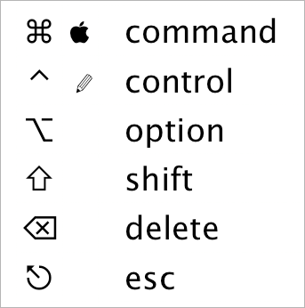

# Documents Repository

## Abstract

wnoguchiの公開してもいいドキュメントを入れていくリポジトリです。

## About me

### Introduction

なんとかしがみついて生きてるシステムエンジニア。  
どちらかというとネットワークやサーバー構築などのインフラ関係の事のほうが好きです。  

業務系アプリ・Webアプリケーション開発全般。ネットワークエンジニア。  
こんなクズがよく生きてるなって思います。コミュ障。学歴は察してください。

アニメ、お昼寝、サーバー構築、トマトジュース、なでしこが好き。 Linux、Android、Mac、Windowsが好き。

#### Language

Ruby / Java / PHP / C# / VB.NET / VBA（Excelマクロメイン） / Flex / C++ / C / なでしこ JavaScript / HTML / CSS

#### Database

MySQL, PostgreSQL, SQL Server

#### Framework

Ruby on Rails / Struts / CakePHP / jQuery / ASP.NET / Swing / Flex / prototype.js

#### OS

Windows / Linux / Mac OS X

#### Linux/UNIX Technologies

DNS / Postfix / KVM / CentOS / Ubuntu / bash

### Social Accounts

Contact me: wnoguchi@pg1x.com

#### GitHub

https://github.com/wnoguchi

#### Gist

https://gist.github.com/wnoguchi

#### Qiita

http://qiita.com/wnoguchi

#### Twitter

https://twitter.com/wnoguchi

#### Facebook

https://www.facebook.com/watarunoguchi.0727

#### Blog

http://blog.pg1x.com/

#### Organization

http://www.unicast.ne.jp/  
http://lab.unicast.ne.jp/

#### Tumblr

http://tumblr.pg1x.com/

## Etc.

### Mac

## Links

### Markdown

#### [GitHub Flavored Markdown · GitHub Help](https://help.github.com/articles/github-flavored-markdown)  

MacではエディタはMouがよさげ。
