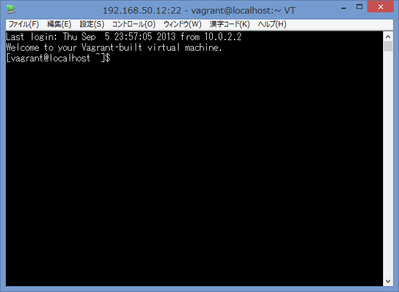

# Chefで構成管理

ここではchef-solo。  
CentOSはイバラの道らしいのでUbuntu13.04で。

## Getting Started

### インストール

```
curl -L http://www.opscode.com/chef/install.sh | sudo bash
```

### レポジトリの作成

```
git clone git://github.com/opscode/chef-repo.git
```

```
knife configure
```

### クックブック作成

```
cd chef-repo/
knife cookbook create hello -o cookbooks
** Creating cookbook hello
** Creating README for cookbook: hello
** Creating CHANGELOG for cookbook: hello
** Creating metadata for cookbook: hello
```

### レシピ編集

```ruby
# cookbooks/hello/recipes/default.rb
#
# Cookbook Name:: hello
# Recipe:: default
#
# Copyright 2013, YOUR_COMPANY_NAME
#
# All rights reserved - Do Not Redistribute
#

log "Hello, Chef!"
```

### 実行するレシピの一覧の定義

```json
// localhost.json
{
  "run_list": [
    "recipe[hello]"
  ]
}

```

### chef-soloの設定

```ruby
# solo.rb
file_cache_path "/tmp/chef-solo"
cookbook_path [ "/home/wnoguchi/chef-repo/cookbooks" ]
```

### 実行

```
sudo chef-solo -c solo.rb -j ./localhost.json

Starting Chef Client, version 11.6.0
Compiling Cookbooks...
Converging 1 resources
Recipe: hello::default
  * log[Hello, Chef!] action write

Chef Client finished, 1 resources updated

```

zshを入れてみる

```ruby
package "zsh" do
  action :install
end
```

さらにRubyの文法を活用してみる。  
ちなみにAmazon LinuxではなくてUbuntuでやってるのでパッケージ名はUbuntuのパッケージングリポジトリに載ってる名前でやらないとエラーになるみたい。

```ruby
%w{zsh gcc make libreadline-dev vim}.each do |pkg|
  package pkg do
    action :install
  end
end
```

出力は以下のとおり。

```
Starting Chef Client, version 11.6.0
Compiling Cookbooks...
Converging 6 resources
Recipe: hello::default
  * log[Hello, Chef!] action write

  * package[zsh] action install
    - install version 5.0.0-2ubuntu3 of package zsh

  * package[gcc] action install (up to date)
  * package[make] action install (up to date)
  * package[libreadline-dev] action install
    - install version 6.2-9ubuntu1 of package libreadline-dev

  * package[vim] action install
    - install version 2:7.3.547-6ubuntu5 of package vim

Chef Client finished, 4 resources updated
```

## nginx

```
knife cookbook create nginx -o cookbooks 
** Creating cookbook nginx
** Creating README for cookbook: nginx
** Creating CHANGELOG for cookbook: nginx
** Creating metadata for cookbook: nginx

```

```ruby
# cookbooks/nginx/recipes/default.rb

package "nginx" do
  action :install
end

service "nginx" do
  supports :status => true, :restart => true, :reload => true
  action [ :enable, :start ]
end

template "nginx.conf" do
  path "/etc/nginx/nginx.conf"
  source "nginx.conf.erb"
  owner "root"
  owner "root"
  mode 0644
  notifies :reload, 'service[nginx]'
end
```

```
# cookbooks/nginx/templates/default/nginx.conf.erb

user nginx;
worker_processes 1;
error_log /var/log/nginx/error.log;
pid /var/run/nginx.pid

events {
  worker_connections 1024;
}

http {
  include /etc/nginx/mime.types;
  default_type application/octet-stream;

  server {
    listen <%= node['nginx']['port'] %>;
    server_name localhost;
    location / {
      root /usr/share/nginx/html;
      index index.html index.htm;
    }
  }
}
```

```
// localhost.json
{
  "nginx": {
    "port": 80
  },
  "run_list": [
    "nginx"
  ]
}
```

```
tree -F
.
├── CHANGELOG.md
├── README.md
├── attributes/
├── definitions/
├── files/
│   └── default/
├── libraries/
├── metadata.rb
├── providers/
├── recipes/
│   └── default.rb
├── resources/
└── templates/
    └── default/
        └── nginx.conf.erb

10 directories, 5 files
```

```
sudo chef-solo -c solo.rb -j ./localhost.json


Starting Chef Client, version 11.6.0
Compiling Cookbooks...
Converging 3 resources
Recipe: nginx::default
  * package[nginx] action install
    - install version 1.2.6-1ubuntu3.2 of package nginx

  * service[nginx] action enable (up to date)
  * service[nginx] action start
    - start service service[nginx]

  * template[nginx.conf] action create
    - update content in file /etc/nginx/nginx.conf from 9492ca to 267bcf
        --- /etc/nginx/nginx.conf	2012-12-17 15:57:45.000000000 +0900
        +++ /tmp/chef-rendered-template20130905-9585-1mv06ac	2013-09-05 08:57:28.333738529 +0900
        @@ -1,95 +1,24 @@
        -user www-data;
        -worker_processes 4;
        -pid /run/nginx.pid;
        +
        +user nginx;
        +worker_processes 1;
        +error_log /var/log/nginx/error.log;
        +pid /var/run/nginx.pid
         
         events {
        -	worker_connections 768;
        -	# multi_accept on;
        +  worker_connections 1024;
         }
         
         http {
        +  include /etc/nginx/mime.types;
        +  default_type application/octet-stream;
         
        -	##
        -	# Basic Settings
        -	##
        -
        -	sendfile on;
        -	tcp_nopush on;
        -	tcp_nodelay on;
        -	keepalive_timeout 65;
        -	types_hash_max_size 2048;
        -	# server_tokens off;
        -
        -	# server_names_hash_bucket_size 64;
        -	# server_name_in_redirect off;
        -
        -	include /etc/nginx/mime.types;
        -	default_type application/octet-stream;
        -
        -	##
        -	# Logging Settings
        -	##
        -
        -	access_log /var/log/nginx/access.log;
        -	error_log /var/log/nginx/error.log;
        -
        -	##
        -	# Gzip Settings
        -	##
        -
        -	gzip on;
        -	gzip_disable "msie6";
        -
        -	# gzip_vary on;
        -	# gzip_proxied any;
        -	# gzip_comp_level 6;
        -	# gzip_buffers 16 8k;
        -	# gzip_http_version 1.1;
        -	# gzip_types text/plain text/css application/json application/x-javascript text/xml application/xml application/xml+rss text/javascript;
        -
        -	##
        -	# nginx-naxsi config
        -	##
        -	# Uncomment it if you installed nginx-naxsi
        -	##
        -
        -	#include /etc/nginx/naxsi_core.rules;
        -
        -	##
        -	# nginx-passenger config
        -	##
        -	# Uncomment it if you installed nginx-passenger
        -	##
        -	
        -	#passenger_root /usr;
        -	#passenger_ruby /usr/bin/ruby;
        -
        -	##
        -	# Virtual Host Configs
        -	##
        -
        -	include /etc/nginx/conf.d/*.conf;
        -	include /etc/nginx/sites-enabled/*;
        +  server {
        +    listen 80;
        +    server_name localhost;
        +    location / {
        +      root /usr/share/nginx/html;
        +      index index.html index.htm;
        +    }
        +  }
         }
         
        -
        -#mail {
        -#	# See sample authentication script at:
        -#	# http://wiki.nginx.org/ImapAuthenticateWithApachePhpScript
        -# 
        -#	# auth_http localhost/auth.php;
        -#	# pop3_capabilities "TOP" "USER";
        -#	# imap_capabilities "IMAP4rev1" "UIDPLUS";
        -# 
        -#	server {
        -#		listen     localhost:110;
        -#		protocol   pop3;
        -#		proxy      on;
        -#	}
        -# 
        -#	server {
        -#		listen     localhost:143;
        -#		protocol   imap;
        -#		proxy      on;
        -#	}
        -#}

  * service[nginx] action reload
================================================================================
Error executing action `reload` on resource 'service[nginx]'
================================================================================


Mixlib::ShellOut::ShellCommandFailed
------------------------------------
Expected process to exit with [0], but received '1'
---- Begin output of /etc/init.d/nginx reload ----
STDOUT: 
STDERR: 
---- End output of /etc/init.d/nginx reload ----
Ran /etc/init.d/nginx reload returned 1


Resource Declaration:
---------------------
# In /home/wnoguchi/chef-repo/cookbooks/nginx/recipes/default.rb

 14: service "nginx" do
 15:   supports :status => true, :restart => true, :reload => true
 16:   action [ :enable, :start ]
 17: end
 18: 


Compiled Resource:
------------------
# Declared in /home/wnoguchi/chef-repo/cookbooks/nginx/recipes/default.rb:14:in `from_file'

service("nginx") do
  action [:enable, :start]
  updated true
  supports {:status=>true, :restart=>true, :reload=>true}
  retries 0
  retry_delay 2
  service_name "nginx"
  enabled true
  running true
  pattern "nginx"
  startup_type :automatic
  cookbook_name :nginx
  recipe_name "default"
end


[2013-09-05T08:57:28+09:00] ERROR: Running exception handlers
[2013-09-05T08:57:28+09:00] ERROR: Exception handlers complete
[2013-09-05T08:57:28+09:00] FATAL: Stacktrace dumped to /tmp/chef-solo/chef-stacktrace.out
Chef Client failed. 3 resources updated
[2013-09-05T08:57:28+09:00] FATAL: Chef::Exceptions::ChildConvergeError: Chef run process exited unsuccessfully (exit code 1)

```

エラー。。。  
Ubuntu仕様に書き直してみる。

```
# cookbooks/nginx/templates/default/nginx.conf.erb

user www-data;
worker_processes 4;
error_log /var/log/nginx/error.log;
pid /run/nginx.pid;

events {
  worker_connections 1024;
}

http {
  include /etc/nginx/mime.types;
  default_type application/octet-stream;

  server {
    listen <%= node['nginx']['port'] %>;
    server_name localhost;
    location / {
      root /usr/share/nginx/html;
      index index.html index.htm;
    }
  }
}

```

もう一度。

```
sudo chef-solo -c solo.rb -j ./localhost.json      
[sudo] password for unicast: 
Starting Chef Client, version 11.6.0
Compiling Cookbooks...
Converging 3 resources
Recipe: nginx::default
  * package[nginx] action install (up to date)
  * service[nginx] action enable (up to date)
  * service[nginx] action start (up to date)
  * template[nginx.conf] action create
    - update content in file /etc/nginx/nginx.conf from 267bcf to c7207c
        --- /etc/nginx/nginx.conf	2013-09-05 08:57:28.333738529 +0900
        +++ /tmp/chef-rendered-template20130905-10526-3gql20	2013-09-05 12:21:47.854516784 +0900
        @@ -1,8 +1,8 @@
         
        -user nginx;
        -worker_processes 1;
        +user www-data;
        +worker_processes 4;
         error_log /var/log/nginx/error.log;
        -pid /var/run/nginx.pid
        +pid /run/nginx.pid;
         
         events {
           worker_connections 1024;

  * service[nginx] action reload
    - reload service service[nginx]

Chef Client finished, 2 resources updated

```

今度はうまく行った。  
ポートを変えてみる。

```
sudo chef-solo -c solo.rb -j ./localhost.json
Starting Chef Client, version 11.6.0
Compiling Cookbooks...
Converging 3 resources
Recipe: nginx::default
  * package[nginx] action install (up to date)
  * service[nginx] action enable (up to date)
  * service[nginx] action start (up to date)
  * template[nginx.conf] action create
    - update content in file /etc/nginx/nginx.conf from c7207c to 14074a
        --- /etc/nginx/nginx.conf	2013-09-05 12:21:47.854516784 +0900
        +++ /tmp/chef-rendered-template20130905-10918-1r1m3qi	2013-09-05 12:23:09.728528973 +0900
        @@ -13,7 +13,7 @@
           default_type application/octet-stream;
         
           server {
        -    listen 80;
        +    listen 8080;
             server_name localhost;
             location / {
               root /usr/share/nginx/html;

  * service[nginx] action reload
    - reload service service[nginx]

Chef Client finished, 2 resources updated
```

よし。

iptablesをoffにする。

```
service 'iptables' do
  action [ :disable, :stop ]
end
```

## Vagrant

http://www.vagrantbox.es/

以下はまだやってない。

```
# CentOS 6.3
vagrant box add base http://developer.nrel.gov/downloads/vagrant-boxes/CentOS-6.3-x86_64-v20130101.box
（...とても時間がかかる）

# CentOS 6.4
vagrant box add base http://developer.nrel.gov/downloads/vagrant-boxes/CentOS-6.4-x86_64-v20130731.box

mkdir example
cd example
vagrant init
A `Vagrantfile` has been placed in this directory. You are now
ready to `vagrant up` your first virtual environment! Please read
the comments in the Vagrantfile as well as documentation on
`vagrantup.com` for more information on using Vagrant.
```

```ruby
# Vagrantfile
Vagrant::Config.run do |config|
  config.vm.box = "base"
#(snip)
  config.vm.network :private_network, ip: "192.168.50.12"
#(snip)
```

```
vagrant up

Bringing machine 'default' up with 'virtualbox' provider...
[default] Importing base box 'base'...
[default] Matching MAC address for NAT networking...
[default] Setting the name of the VM...
[default] Clearing any previously set forwarded ports...
[default] Creating shared folders metadata...
[default] Clearing any previously set network interfaces...
[default] Preparing network interfaces based on configuration...
[default] Forwarding ports...
[default] -- 22 => 2222 (adapter 1)
[default] Booting VM...
[default] Waiting for VM to boot. This can take a few minutes.
[default] VM booted and ready for use!
[default] Configuring and enabling network interfaces...
[default] Mounting shared folders...
[default] -- /vagrant
```

```
C:\Users\noguchi>ping 192.168.50.12

192.168.50.12 に ping を送信しています 32 バイトのデータ:
192.168.50.12 からの応答: バイト数 =32 時間 <1ms TTL=64
192.168.50.12 からの応答: バイト数 =32 時間 <1ms TTL=64
192.168.50.12 からの応答: バイト数 =32 時間 <1ms TTL=64
192.168.50.12 からの応答: バイト数 =32 時間 <1ms TTL=64

192.168.50.12 の ping 統計:
    パケット数: 送信 = 4、受信 = 4、損失 = 0 (0% の損失)、
ラウンド トリップの概算時間 (ミリ秒):
    最小 = 0ms、最大 = 0ms、平均 = 0ms
```

```
D:\Users\noguchi\Documents\tmp\example_box>vagrant ssh
Welcome to your Vagrant-built virtual machine.
[vagrant@localhost ~]$ ls
[vagrant@localhost ~]$ ls /
bin   cgroup  etc   lib    lost+found  mnt  proc  sbin     srv  tmp  vagrant
boot  dev     home  lib64  media       opt  root  selinux  sys  usr  var
```



```
D:\Users\noguchi\Documents\tmp\example_box>vagrant halt
[default] Attempting graceful shutdown of VM...

D:\Users\noguchi\Documents\tmp\example_box>vagrant destroy
Are you sure you want to destroy the 'default' VM? [y/N] y
[default] Destroying VM and associated drives...
```

### sahara

```
>vagrant plugin install sahara
Installing the 'sahara' plugin. This can take a few minutes...
Installed the plugin 'sahara (0.0.15)'!

>vagrant up

>vagrant sandbox on
0%...10%...20%...30%...40%...50%...60%...70%...80%...90%...100%

>vagrant sandbox rollback
0%...10%...20%...30%...40%...50%...60%...70%...80%...90%...100%
0%...10%...20%...30%...40%...50%...60%...70%...80%...90%...100%

>vagrant sandbox commit

>vagrant sandbox off


```

## knife-solo

```
sudo gem install knife-solo --no-ri --no-rdoc

Building native extensions.  This could take a while...
ERROR:  Error installing knife-solo:
	ERROR: Failed to build gem native extension.

        /usr/bin/ruby1.9.1 extconf.rb
/usr/lib/ruby/1.9.1/rubygems/custom_require.rb:36:in `require': cannot load such file -- mkmf (LoadError)
	from /usr/lib/ruby/1.9.1/rubygems/custom_require.rb:36:in `require'
	from extconf.rb:1:in `<main>'


sudo apt-get -y install ruby-dev

sudo gem install knife-solo --no-ri --no-rdoc


gem list knife-solo

*** LOCAL GEMS ***

knife-solo (0.3.0)


vi ~/.chef/knife.rb

knife[:solo_path] = '/tmp/chef-solo'


```

## 参考サイト

### Chef系

- [Amazon.co.jp： 入門Chef Solo - Infrastructure as Code eBook: 伊藤直也: Kindleストア](http://www.amazon.co.jp/%E5%85%A5%E9%96%80Chef-Solo-Infrastructure-Code-ebook/dp/B00BSPH158)  
主にこれを参考にさせてもらっています。
- [特集　DevOps時代の必須知識：インフラストラクチャ自動化フレームワーク「Chef」の基本 (1/2) - ＠IT](http://www.atmarkit.co.jp/ait/articles/1305/24/news003.html)
- [Rubyist Magazine - Chef でサーバ管理を楽チンにしよう！ (第 1 回)](http://magazine.rubyist.net/?0035-ChefInDECOLOG)
- [Chef Soloの正しい始め方 | tsuchikazu blog](http://tsuchikazu.net/chef_solo_start/)
- [Chef Soloと Knife Soloでの　ニコニコサーバー構築 (1):dwango エンジニア ブロマガ:ドワンゴ研究開発チャンネル(ドワンゴグループのエンジニア) - ニコニコチャンネル:生活](http://ch.nicovideo.jp/dwango-engineer/blomaga/ar311555)
- [Windows7上で Vagrant + Chef solo + knife-soloを使い、Ubuntu + ubuntu-desktopの環境を構築してみた - メモ的な思考的な](http://d.hatena.ne.jp/thinkAmi/20130407/1365310673)
- [入門Chef Solo - Infrastructure as Code - 達人出版会](http://tatsu-zine.com/books/chef-solo)

### Vagrant系

- [vagrant windows環境でSSH for Teraterm - clash_m45の開発日記](http://d.hatena.ne.jp/clash_m45/20130716/1373975271)
- [Ruby - Vagrant and Chef on Windows - Qiita [キータ]](http://qiita.com/ogomr/items/98a33f47f6ba050adac4)
- [Window 7 でVagrantでCent OS 6.3入れてみた - 僕の車輪の再発明](http://kazuph.hateblo.jp/entry/2013/02/05/234243)
